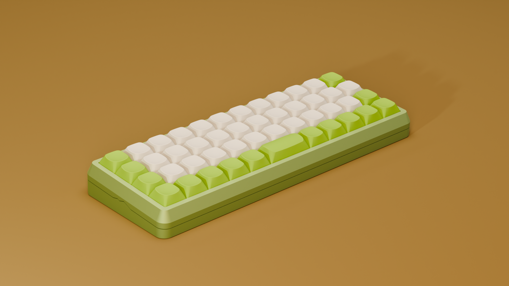

# open-keyboard

I want a cool keyboard, and if I am going to spend so much money on a good one that someone else makes why not spend even more money for a worse one that I make?

## Journal

There is a [journal](./journal/02-layout-framing.md) here somewhere that documents the process.

## Acknowledgements

This project uses or is inspired by a lot of open-source tools, projects, and generous people who documented their work. Thank you so much!

### Tools & Software
- [Keyboard Layout Editor](https://www.keyboard-layout-editor.com) — Ian Prest's layout design tool, used for every layout iteration
- [QMK Firmware](https://qmk.fm) — the open-source "Quantum Mechanical Keyboard" firmware
- [FreeCAD](https://www.freecad.org) — open-source CAD used for the case design
- [KiCad](https://www.kicad.org) — open-source EDA used for the schematic and PCB
- [Blender](https://www.blender.org) — used for the renders
- [Plate & Case Builder](http://builder.swillkb.com) — swillkb's tool for generating plates/cases from a layout

### Open-Source Projects & Libraries
- [cubiq/OPK](https://github.com/cubiq/OPK) — open keycap profile / library (included as a submodule)
- [CadQuery](https://github.com/CadQuery/cadquery) — Python-based parametric CAD used for keycap generation
- [ai03-2725/MX_V2](https://github.com/ai03-2725/MX_V2) — MX switch KiCad component library
- [ebastler/marbastlib](https://github.com/ebastler/marbastlib) — recent MX hotswap footprint library (the one I went with)
- [kiswitch/kiswitch](https://github.com/kiswitch/kiswitch) — switch footprint library
- [olkb/olkb_parts](https://github.com/olkb/olkb_parts) — OLKB's CAD parts, referenced for case design
- [adafruit/Adafruit-Feather-RP2040-PCB](https://github.com/adafruit/Adafruit-Feather-RP2040-PCB) — RP2040 reference design
- [Unified Daughterboard standard](https://unified-daughterboard.github.io) — daughterboard spec for the gasket-mount design
- [network2501/planck](https://github.com/network2501/planck) — long-press shift layout idea

### Guides & Articles
- [Ruiqi Mao's Keyboard PCB Guide](https://github.com/ruiqimao/keyboard-pcb-guide) — invaluable PCB walkthrough
- [The Planck Constant](http://thedarnedestthing.com/planck%20constant) — thoughtful write-up on Planck layout design
- [Evan Travers — 40% keyboard layouts](https://evantravers.com/articles/2019/04/20/community-post-40-keyboard-layouts/) — community layout roundup
- [Designing Keycaps for Fun and Profit (kbd.news)](https://kbd.news/Designing-Keycaps-for-Fun-and-Profit-1775.html) — PBS keycap creator's guide
- [RP2040 Hardware Design Guide (Raspberry Pi)](https://pip-assets.raspberrypi.com/categories/814-rp2040/documents/RP-008279-DS-1-hardware-design-with-rp2040.pdf?disposition=inline)
- [How to make your PCB hotswappable](https://www.reddit.com/r/MechanicalKeyboards/comments/5a399o/guide_how_to_make_your_pcb_hotswappable/)

### Community Threads & Inspiration
- [r/olkb](https://www.reddit.com/r/olkb/) and [r/MechanicalKeyboards](https://www.reddit.com/r/MechanicalKeyboards/wiki/customkeyboards/) — the wikis, guides, and countless threads
- [Detailed guide to making a custom keyboard](https://www.reddit.com/r/MechanicalKeyboards/comments/4l0p41/guide_detailed_guide_to_making_a_custom_keyboard/)
- [Default Planck layout thread](https://www.reddit.com/r/MechanicalKeyboards/comments/4vs3iz/this_is_the_default_planck_layout/) and [Planck PCB options](https://www.reddit.com/r/olkb/comments/rh9r3n/planck_pcb_options/)
- [40s keycaps — where to begin](https://www.reddit.com/r/MechanicalKeyboards/comments/dzamyl/40s_keycaps_where_to_begin/)
- [Gasket mounting discussion (geekhack)](https://geekhack.org/index.php?topic=101731.0) and [switch LED orientation (geekhack)](https://geekhack.org/index.php?topic=72713.0)
- [Planck PCB rev 6 (imgur)](https://imgur.com/a/planck-pcb-rev-6-8gn3UQs) — component-margin reference
- Geonix and YMDK Air 40 builds that got me started (linked in the README)

