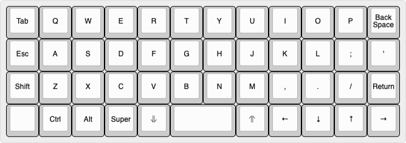
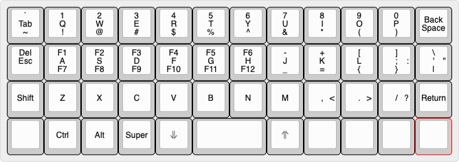

# Customizing the layout

The first and most important job of any keyboard, I am told, is to figure out the layout. It's awesome that I get to choose it myself. Here are some considerations:

1. **Tiny vs Normal:** I never really wanted a big keyboard, but I think a tiny keyboard is cute! I really want to check things out at the 40% regions of the keyboard nieche. 
Anyway since we're making everything from scratch, finding parts shouldn't really be an issue.
2. **Ortho vs Staggered:** While I am still learning how to consistently type properly perhaps having an ortho layout would be so cool, I also feel like doing this project would give me incentice to really learn how to type with such a keyboard. 
tbh, my computer really is unusable by anyone other than me, and I am handicapped when I go visit other people's computers anyway, so might as well transmit this issue in my keyboard too. 

## Designing the layout
I heard [keyboard-layout-editor](https://www.keyboard-layout-editor.com) is a good place to build a layout from scratch in most standard key arrangements or whatever that's called. We can also try to use keyd to implement the layout or a close approximation to my laptop keyboard to try and get used to it or optimize it along the process. 

[Planck](https://www.reddit.com/r/MechanicalKeyboards/comments/4vs3iz/this_is_the_default_planck_layout/) is a commonly used layout for 40% ortholinear keyboards which is the hard choice in both of my considerations above, but we can see where we can go from there.
The main plus about it is that it has two switches for going up and down layers along with other modifiers which are located right next to the spacebar in a natural position of the thumbs to rest. Here it is 

We can iterate on this a bit. This was my first attempt.

It is not bad, and it's getting me quite excited. However, there seems to be a key issue. Learning how to type properly I learned To rely on the right shift which is now replaced by a return button which honestly isn't in the best position for me. Here are some ideas to fix that

1. Add an extra column of keys at the right end. 
This is not ideal. The whole point of the planck layout was to not have to extend a finger more than one key length. However, it might be a welcome compromise in order to return a home row return key. Yet the keyboard would no longer be symmetric which kind throws me off. 
2. Rework the apostrophy key position. Honestly it is the most annoying key to type by far, and it took me so much time to learn how to do it wihtout lifting my hand off the keyboard. However if we place it somewhere else we might be able to move the return key in its place and have the shift reclaim its original place. 
3. Another solution I found [here](https://github.com/network2501/planck) is to make shift keys long press. I never really through about that, but this makes perfect sense. I never type a shift key if it's not long press. That changes the home row enter key, but honestly I am not as mad about that as not having a right shift. 

In addition, the original Planck layout has a bunch of arrow keys, that I would really like to move to the home row instead. I am already comfortable with using HJKL for navigation so maybe it won't be such an issue. Plus, I move around with my mod key anyway on my workspace. 

Summary of Issues:

1. No right shift.
2. Enter is awkward.
3. \ for latex would be a pain to type as constantly as needed.
4. No real themeing for different functions. 

The rest of the keys look fine I guess. However, there is this [super nice article](http://thedarnedestthing.com/planck%20constant) about setting up a planck layout. I like the idea of using two spacebar keys that re modified depending on some modifier key. 

Also here is a [bunch of people's 4x12 layouts](https://evantravers.com/articles/2019/04/20/community-post-40-keyboard-layouts/)

Finally this has some nice things to [keep in mind](https://www.keyboard-layout-editor.com/#/gists/d06425aaccaef71cf3d0ffbc0e2042ba) while designing a custom 40% keyboard. I really like the idea of having a themed layout so maybe we can try and do that next. At some point I would like to optimize for latex and whatnot, so it would be nice to find out what the right balance for familiarity and ease of use would be.  
I found this funny [thread](https://www.reddit.com/r/MechanicalKeyboards/comments/5xp9h4/help_improve_typing_symbols_on_planck/) that suggests this [keymap](https://esinc.net/happyfamily/keymap.c) for a latex optimized layout.

There is this open source software [quantum mechanical keyboard](https://qmk.fm) that apparently has many layouts already implemented. Though they don't seem to be that crazy. 

