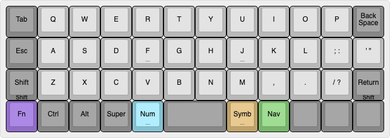
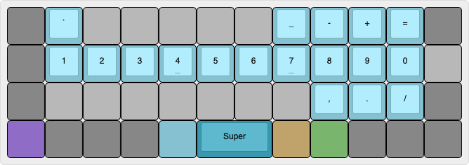
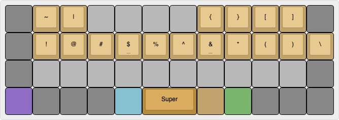
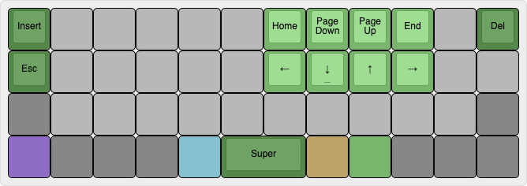
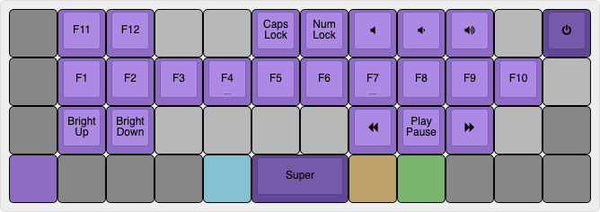

# Giving thought to the layout

Clearly first ideas suck. Not to be deterred though, we can do better! Time to give some more thought to how to design the planck layout that actually works for my workflow. So here are some modes

1. **Base**: Some version of standard qwerty. I want the stuff I know to be easily transferred there. The only question is what happens to the '" key. I have really only learned how to use it for typing "n't"and for the rest I have to really slow down and turn on my non muscle memory to type it. Shift and enter can share a spot since I only use shift in combination with other keys. We can have enter hit on release and if I chain it with any other key then it acts as shift. Another consideration would be weather to include the \ key directly in or have it in a mod layer
2. **Number**: Numbers in the home row sounds fun but I have to think about how I use them for things like motions in vim. I would often have to switch between letters and numbers so they need to be readily accessible.  
3. **Symbol**: A layer for all the sumbol keys perhaps including \ where ' is so that I can access it quickly. But this should have all the brackets accessible and whatnot, so perhaps it would be nice to have them in the home row just as well as operations. The symbol and number layers might be chained often so it would be nice to have them activated by different hands. 
4. **Navigation**: HJKL are swapped with arrows, perhaps add page up and down and whatnot there. I am not sure if that layer should be able to be activeted by both hands. Some non-vim text editors really rely on being able to do C+-> or other things so having more accessible options might be better. 
5. **Function**: Brings back function keys. Perhaps F keys on the home row, and their corresponding function keys on the one above like volume brightness and whatnot. 

## Base

One interesting layout for the base would be [this](https://www.keyboard-layout-editor.com/##@@_c=%23878787&a:7%3B&=Tab&_c=%23b8b8b8%3B&=Q&=W&=E&=R&=T&=Y&=U&=I&=O&=P&_c=%23878787%3B&=Back%20Space%3B&@=Esc&_c=%23b8b8b8%3B&=A&=S&=D&_n:true%3B&=F&=G&=H&_n:true%3B&=J&=K&=L&=%2F%3B%20%2F:&='%20%22%3B&@_c=%23878787%3B&=Shift%0A%0A%0A%0AShift&_c=%23b8b8b8%3B&=Z&=X&=C&=V&=B&=N&=M&=,&=.&=%2F%2F%20%3F&_c=%23878787%3B&=Return%0A%0A%0A%0AShift%3B&@_c=%238f6dc7%3B&=Fn&_c=%23878787%3B&=Ctrl&=Alt&=Super&_c=%2386c1d1&n:true%3B&=Num&_c=%23878787&w:2%3B&=&_c=%23bfa36b&n:true%3B&=Symb&_c=%2379b56d%3B&=Nav&_c=%23878787%3B&=&=&=). 

The modes are highlighted with different colors, and the bottom part really means that if you long press you get shift. 
It has kept the qwerty keys as they are, has home row escape which I LOVE, and the placement of the num and symb keys with homing bumps so that I always know if I am pressing these, or the nav section. Symb is going to be used a lot when typing latex and stuff so I want it at areally natural place.  

## Number

How about [this](https://www.keyboard-layout-editor.com/##@@_c=%23878787&g:true&a:7%3B&=Tab&_c=%2386c1d1&g:false%3B&=%60&_c=%23b8b8b8&g:true%3B&=W&=E&=R&=T&=Y&_c=%2386c1d1&g:false%3B&=%2F_&=-&=+&=%2F=&_c=%23878787&g:true%3B&=Back%20Space%3B&@=Esc&_c=%2386c1d1&g:false%3B&=1&=2&=3&_n:true%3B&=4&=5&=6&_n:true%3B&=7&=8&=9&=0&_c=%23b8b8b8&g:true%3B&=%7C%3B&@_c=%23878787%3B&=Shift%0A%0A%0A%0AShift&_c=%23b8b8b8%3B&=Z&=X&=C&=V&=B&=N&=M&_c=%2386c1d1&g:false%3B&=,&=.&=%2F%2F&_c=%23878787&g:true%3B&=Return%0A%0A%0A%0AShift%3B&@_c=%238f6dc7%3B&=Fn&_c=%23878787%3B&=Ctrl&=Alt&=Super&_c=%2386c1d1&n:true%3B&=Num&_c=%233998ad&g:false&w:2%3B&=Super&_c=%23bfa36b&g:true&n:true%3B&=Symb&_c=%2379b56d%3B&=Nav&_c=%23878787%3B&=&=&=).

It has the operations all stacked out. I found out that I use ,. and / quite often when I am typing numbers, so perhaps it would be nice to keep these when the number mod key is pressed just in case.
There areoeprations on the top that are clearly separated and I like the underscore above J it sounds like it's going to be convenient. 
One more thing is that I have a lot of SUPER + NUMBER keys on my monitor setup so I think the most accessible way to have the super key is to press it with another thumb so I put it where space is, since I won't have to touch it that often anyway. I think this is a good solution for now. Other modes can share the space key to be the super key. 

## Symbol

I think [this](https://www.keyboard-layout-editor.com/##@@_c=%23878787&g:true&a:7%3B&=Tab&_c=%23bfa36b&g:false%3B&=~&=%7C&_c=%23b8b8b8&g:true%3B&=E&=R&=T&=Y&_c=%23bfa36b&g:false%3B&=%7B&=%7D&=%5B&=%5D&_c=%23878787&g:true%3B&=Back%20Space%3B&@=Esc&_c=%23bfa36b&g:false%3B&=!&=%2F@&=%23&_n:true%3B&=$&=%25&=%5E&_n:true%3B&=%2F&&=*&=(&=)&=%5C%3B&@_c=%23878787&g:true%3B&=Shift%0A%0A%0A%0AShift&_c=%23b8b8b8%3B&=Z&=X&=C&=V&=B&=N&=M&=,&=.&=%2F%2F%20%3F&_c=%23878787%3B&=Return%0A%0A%0A%0AShift%3B&@_c=%238f6dc7%3B&=Fn&_c=%23878787%3B&=Ctrl&=Alt&=Super&_c=%2386c1d1&n:true%3B&=Num&_c=%23b58b3e&g:false&w:2%3B&=Super&_c=%23bfa36b&g:true&n:true%3B&=Symb&_c=%2379b56d%3B&=Nav&_c=%23878787%3B&=&=&=) will do.

It has all the mod keys in the qwerty order but brings the \ character in a more accessible place as well as the parentheses and stuff in a nicely wrapped place. 
It also has the same super key thing bound at the spacebar for easy access.

## Navigation

I got [this](https://www.keyboard-layout-editor.com/##@@_c=%23548749&a:7%3B&=Insert&_c=%23b8b8b8&g:true%3B&=Q&=W&=E&=R&=T&_c=%2379b56d&g:false%3B&=Home&=Page%20Down&=Page%20Up&=End&_c=%23b8b8b8&g:true%3B&=P&_c=%23548749&g:false%3B&=Del%3B&@=Esc&_c=%23b8b8b8&g:true%3B&=A&=S&=D&_n:true%3B&=F&=G&_c=%2379b56d&g:false%3B&=%2F&larr%2F%3B&_n:true%3B&=%2F&darr%2F%3B&=%2F&uarr%2F%3B&=%2F&rarr%2F%3B&_c=%23b8b8b8&g:true%3B&=%2F%3B%20%2F:&='%20%22%3B&@_c=%23878787%3B&=Shift%0A%0A%0A%0AShift&_c=%23b8b8b8%3B&=Z&=X&=C&=V&=B&=N&=M&=,&=.&=%2F%2F%20%3F&_c=%23878787%3B&=Return%0A%0A%0A%0AShift%3B&@_c=%238f6dc7%3B&=Fn&_c=%23878787%3B&=Ctrl&=Alt&=Super&_c=%2386c1d1&n:true%3B&=Num&_c=%23548749&g:false&w:2%3B&=Super&_c=%23bfa36b&g:true&n:true%3B&=Symb&_c=%2379b56d%3B&=Nav&_c=%23878787%3B&=&=&=).

I don't have much to say about this. It works well HJKL move the arrows and above them are the big cousiins. Delete replaces backspace just in case, escae remains in that mode, also just in case, and tab has been swapped with insert which I really like.
Super key is still bound to spacebar because I do have a lot of keybinds for SUPER + ARROW.

## Function

And finally [here](https://www.keyboard-layout-editor.com/##@@_c=%23878787&g:true&a:7%3B&=Tab&_c=%238f6dc7&g:false%3B&=F11&=F12&_c=%23b8b8b8&g:true%3B&=E&=R&_c=%238f6dc7&g:false%3B&=Caps%20Lock&=Num%20Lock&=%3Ci%20class%2F='fa%20fa-volume-off'%3E%3C%2F%2Fi%3E&=%3Ci%20class%2F='fa%20fa-volume-down'%3E%3C%2F%2Fi%3E&=%3Ci%20class%2F='fa%20fa-volume-up'%3E%3C%2F%2Fi%3E&_c=%23b8b8b8&g:true%3B&=Pause&_c=%23634796&g:false%3B&=%3Ci%20class%2F='fa%20fa-power-off'%3E%3C%2F%2Fi%3E%3B&@_c=%23878787&g:true%3B&=Esc&_c=%238f6dc7&g:false%3B&=F1&=F2&=F3&_n:true%3B&=F4&=F5&=F6&_n:true%3B&=F7&=F8&=F9&=F10&_c=%23b8b8b8&g:true%3B&='%20%22%3B&@_c=%23878787%3B&=Shift%0A%0A%0A%0AShift&_c=%238f6dc7&g:false%3B&=Bright%20Up&=Bright%20Down&_c=%23b8b8b8&g:true%3B&=C&=V&=B&=N&_c=%238f6dc7&g:false%3B&=%3Ci%20class%2F='fa%20fa-backward'%3E%3C%2F%2Fi%3E&=Play%20Pause&=%3Ci%20class%2F='fa%20fa-forward'%3E%3C%2F%2Fi%3E&_c=%23b8b8b8&g:true%3B&=F12&_c=%23878787%3B&=Return%0A%0A%0A%0AShift%3B&@_c=%238f6dc7%3B&=Fn&_c=%23878787%3B&=Ctrl&=Alt&=Super&_c=%2386c1d1&n:true%3B&=Num&_c=%23634796&g:false&w:2%3B&=Super&_c=%23bfa36b&g:true&n:true%3B&=Symb&_c=%2379b56d%3B&=Nav&_c=%23878787%3B&=&=&=) we are!

Functions are where the corresponding numbers were except from F11 and F12. I added caps lock and num lock, which num lock should really just lock the number mode. A power button for sleeping or snoozing and some brightness and volume controls. Super key is still there because I can now do SUPER+F1 which unlocks so many possibilitites. 

## Final thoughts. 

All these are are nice. In particular I am interested in figuring out if this solves the issues that we found in the [previous journal](./01-layout-first-steps.md). It has right shift now, convenient \ for latex, themeing and hopefully I can get used to the return key being there. Also SUPER+non ALpha combinations now work well so we are good to go! (in theory.)

> I am curious if I can experiement with SPACE being SUPER when held down. I am trying to think what use case I have for holding space down, and I don't think that I have any. So it would be nice to experiment with that in the future.
