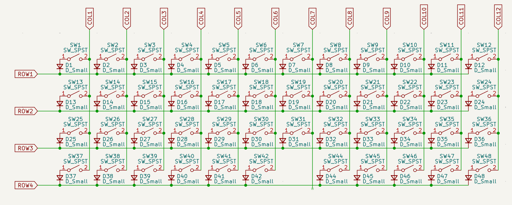

# Picking a PCB

Having decided on the Planck layout there are a couple of things to consider a bout PCBs. 

- Solder or Hot swap. Turns out one doesn't have to solder switches in place if they don't want to by getting special pcbs with recepticles in them. Thing is because I haven't heard what different switches sound like and I would like to have mine be quiet, I might need to iterate on the swtitches so having to solder everything over and over again seems like a bummer. 
- Custom or kit. I would love to design one from scratch but this seems that it would take years to do hehehe. 
- Connectivity. I do want usb-C everything and given that custom keyboarding is dead as a hobby worldwide since before usb-c-ing the world it could be hard to find a nice USB. 
- Microcontroller. TURNS OUT YOU CAN DO THIS WITH A PRO MICRO?! That's awesome! I can write everything in an arduino IDE, or use qmk which apparently works.

[Here](https://www.reddit.com/r/olkb/comments/rh9r3n/planck_pcb_options/) is a thread of people talking about options for a planck pcb like 4 years ago. 
Also, [this](https://customkbd.com/collections/complete-kits/products/contra-40-keyboard-kit) seems to still be available as a kit, which is quite encouraging. I can use whatever microcontroller I want, but I would have to solder all the switches there. Here is another [similar option](https://kprepublic.com/collections/daisy-40/products/jj40-v1-5-40-custom-keyboard-pcb-similar-with-planck).

There is [this article](https://www.reddit.com/r/MechanicalKeyboards/comments/5a399o/guide_how_to_make_your_pcb_hotswappable/) on reddit 10 years ago that teaches you how to turn a pcb into hotswap.

Honestly the more I think about it, the easier it might be to design my own pcb and then send it to JLC or something to cut. Since I don't have to worry too much about the microconstroller, it might actually be just fine, plus apparently the switches can just be wired together in some matrix without any pullups or complicated stuff to figure out. I just have to be careful about how diodes are wired.
Here is a [guide](https://github.com/ruiqimao/keyboard-pcb-guide) which is 10 years old but it doesn't matter! 
Plus if I get the arduino itself, I won't even have to work out clocks and decoupling and all that stuff that I never really wanted to figure out.

You know what? Let's try it out!

## First Attempt

OK! Let's try this. We are going to use ki-cad which is open source, and apparently 10 years ago a bunch of people made the footprints needed for all the components for ki-cad. So this is great. 

There is a nice component library that I can use that is not that outdated right [here](https://github.com/ai03-2725/MX_V2). After some contemplating I decided not to include any space for LEDs. MX switches don't use LEDs anyway, and the way to do that would be to solder LEDs below them I don't really know what the best practices though are so I would like to get the basics down first.

There is a nice [yoututbe video](https://www.youtube.com/watch?v=fYNxG8RwpaE) that is relatively recent that explains some things with kicad.

Anyway it was honestly quite satisfying to get started with the keyboard switches themselves, so here they are.

There is a "missing key" but this is because in our layout the spacebar takes two keys so we have $12\times 4 - 1 = 47$ keys which is a bit unsatisfying but in the future I might just do something like putting a space for the pcb to have the option to put two switcher OR 1 in different places.

## The microcontroller

Turns out that an arduino micro works wonders. But I am worried that if I don't solder my microcontroller in the board, then the keyboard would not be able to take much abuse. So we could simply recreate the arduino in the board! Luckily they provide all [schematics](https://store.arduino.cc/products/arduino-micro-without-headers) for free! They are all open source which I absurdly love.

The way we will do this is by stealing the microcontroller first which is the [ATMega32U4](https://www.microchip.com/en-us/product/atmega32u4) and reading the datasheet we can understand with dread that this is NOT OPEN SOURCE? WTF? While the arduino schematics are open source, this isn't, which is fine. 

After some looking around turns out that Raspberry Pi has developed an open hardware microcontroller the [RP2040](https://www.raspberrypi.com/products/rp2040/). I mean I guess it is not technically open hardware because no microcontroller has a nonpropriatary silicon layout or whatever. However, it has exhaustive documentation and all in good faith, plus is a crap ton faster than the ATMega, so we will use that!

There is a [hardware design guide](https://pip-assets.raspberrypi.com/categories/814-rp2040/documents/RP-008279-DS-1-hardware-design-with-rp2040.pdf?disposition=inline) for this chip which is particularly nice, and helps us not fuck up too hard with everything there. Thankfully thre is also a [youtubea](https://www.youtube.com/watch?v=swTL_IkvzjA) video that explains how to figure out the right width for certain routing and so on. 

## Connectivity

I mean I love USB-C so we will use it! The only real thing I need to keep in mind which I found about online is to use a protection circuit with a bunch of diodes that prevents surges in the data lines of USB.  

When it comes to connecting to the microcontroller we need to take special attention to impedance matching. The only way I understand this is through physics. If the wire of the USB has some impedance and your circuit suddenly has something else the wave will literally reflect or refract causing shockwaves and interference with the data. So it is important to add resistors as well as calibrate the DATA channels of the PCB accordingly so that the pulse travels without breaks.

The hardware design guide gives some extra information on that and how to achieve it. In particular they say that behind the data pins there MUST be just ground otherwise all hell will break loose and we will all die. 

## Power

Technically speaking the RP2040 needs two power sources. 3.3V and 1V. Thankfully it has an onboard voltage regulator from 3.3V to 1V so we only need a regulator from the 5V of the USB-C down to 3.3V. The hardware design guide suggests to use the [NCP1117](https://www.onsemi.com/pdf/datasheet/ncp1117-d.pdf) which is simple to wire and can provide up to 1A which is definitely more than enough for our purposes. I mean we are not even driving LEDs but even if we were there is no reason to care.

The voltage regulator comes in two packages. DPAC which is large and SOT which is small. The only real  difference seems to be how they handle heat. I genuinely don't think that we will have any reason to wory about the heat a 3.3V regulator from 5V would produce for driving a SINGLE measely microcontroller, but just in case, I checked the specs. There is no way we will draw more than 500 mA at 5V and apparently people feel comfortably using SOT (the tiny version) at that. 

Another important consideration according to the schematics is to use decoupling capacitors. we basically want a 100nF capacitor between all ppower pins to be placed physical close to them. Basically the power supply creates so much magnetic field that if it starts oscillating widely it can literally affect the microcontroller. Adding a capacitor turns this into an LC circuit where the power supply fluctuations from induced currents are smoothed out, allowing the microcontroller to operate at a higher efficiency.  

## Crystal

Things are starting to get a bit scary. This is probably because I have the least experience with this, but it seems to be a finicky thing altogether. Basically we want to provide an oscillating voltage on our microprocessor in order for it to act as a clock. While it does have an internal crystal it is highly recommended by raspi to use an external one. They, in-fact gave us the specifications for the crystal they extensively tested and provided ample warning about testing a billion times if you change the crystal.

So, I will go with whatever they said, which is the [ABM8-272-T3](https://www.digikey.com/en/products/detail/abracon-llc/ABM8-272-T3/22472366). The only thing that we need to do in order to hook it up is to estimate the parasitic capacitance in order to make sure things work out. 
