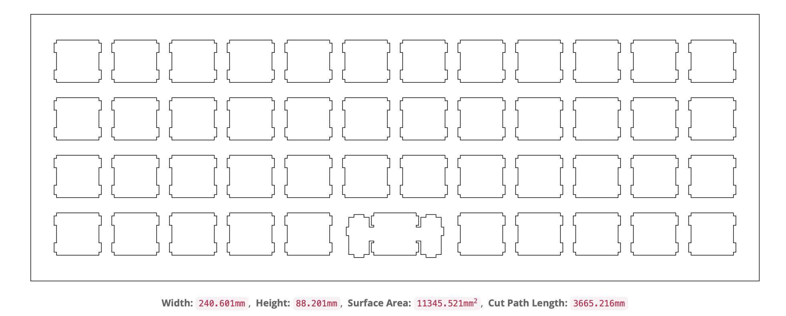

# Case

This actually should feed into how the PCB is designed. Trying to work out the PCB has really showed me that the position of the microcontroller is connected to where the USB port is and whatnot, so perhpas it is time to design the case and figure out at lease super basic ergonomic things. 

## Rough outline

[This open source tool](http://builder.swillkb.com) takes in the layout and designs a case and plate for it. Nothing fancy, if anything it is too simple, but it should serve as an excellent starting point to design the case around

That is the starting point for the plate using the layout we got, and now we are ready to come up with how to design the rest.

## CAD

I am using FreeCAD which is a surprisingly feature rich open source CAD software. In terms of inspiration this is the repo of the [olkb](https://github.com/olkb/olkb_parts) cad designs. They used to make a keyboard with the Planck layout which I loved! It was so minimal and cute, and we can use them as inspiration to understand how to make the case sturdy. 

After looking at it for sometimes the main plan seems to be as follows.

1. Anodized aluminum bottom 1.5 mm or 3 mm thickness.
2. Aluminum top plate that fits inside the bottom part. 
3. Countersunk screws from the bottom that go through the PCB and top plate.
4. Conducitve spacers for between bottom plate and PCB with nuts on top.

The thing that I am worried about is that it might sound really lound and my office mates might go crazy. So it may be worth it to add a layer of foam between the bottom plate and the pcb, or make the top plate out of some acrylic or other plastic, but this is something to figure out after the design. 

The only material I would need to figure out now-ish is the case material since the thicknelss depends on it. 
